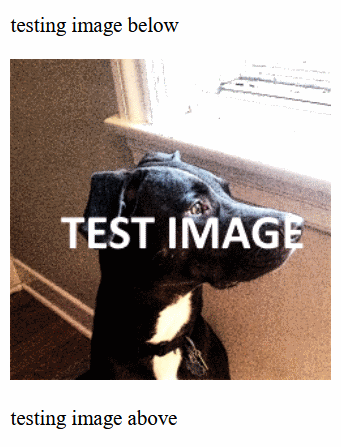
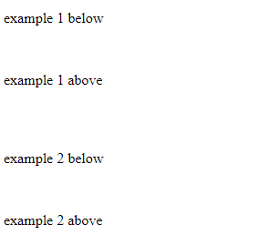

# Markdown Hit Counter

This counter is intended for use in GitHub README markdown files. It has the following features:

* It is accessed in a `` tag in the markdown file.
* It will only count for specified IDs. IDs are a means to identify which README was viewed. 
* It does **not** display the current count. This is intentional.

## Run Time Requirements

You will need:

* A HTTP server, not HTTPS. It has not been tested with HTTPS. **If you get it to work with HTTPS please let me know and I will update this file.**
* The server needs PHP >5.6.
* You will need access to your server to copy files and create a folder.

## Set Up

These set up instructions will verify that it's working. However for *live use* some editing is required, this will be described later.

**1)** Copy the following files to a desired location on your server. Typically this will be in a `public_html` folder or in a sub-folder(*recommended*) of `public_html`.
* counters.json
* mdcount.php
* All PNG files, blank-10x10.png, err-10x10.png, id_err.png, id_oops.png, and test-246x246.png
* **NOTE:** It is not necessary to copy the `mdimg` folder to the server!

**2)** In the folder where you copied the files to create a *new* folder named **logs**.

### Test Run

Open `example.html` in your editor and:

**1)** Find the `` tags and edit the `src` attributes. 

* Replace all occurrences of **`[your-server]/[some-folder]`** with your server's domain and the sub-folder where you placed the files.

**2)** Then on your PC run the `example.html` file by double-clicking it or by dropping it onto an open browser window.

**Test Run Expected Results:**

**a)** At the top of the page you should see this:



**b)** A little further down the page you will see where there does not appear to be an image. It's there, it's just small (10px X 10px) and *transparent*.



**c)** The last two images demonstrate how errors are handled. The two types of errors that can occur are:

* An invalid ID
* The ID query is missing

The images are large *on purpose*. They're meant to be obvious when something is wrong.


**d)** In the folder where you placed the files you will have a *new* file named `testtest_count.log`.

**e)** In the sub-folder named `logs` you should have 2 new files, `example_1_count.log` and `example_2_count.log`.

Each of the `*.log` files should have a count of **`1`** in them.

## Markdown Usage

Use within a GitHub markdown file is easy. You cah add the counter to a `README.md` file or any other `*.md` file in any of your repositories.

The following line can go anywhere in the markdown file but at the bottom is recommended.

**``**

### Edit `counters.json`

The `counters.json` file contains *IDs* that insure that each use has its own *counter log file*. The `counters.json` file in this repository looks like this:

```
{
  "valid":[
    "TESTTEST",
    "example_1",
    "example_2"
  ]
}
```

Then:

**``**

will create this file - `logs/example_1_count.log`, and each time the containing file is opened it will increment the count in that `log` file.

Let's say you have a README in your repository named `My Repo'. First add it to the `counters.json` file like this:

```
{
  "valid":[
    "TESTTEST",
    "example_1",
    "example_2",
    "My_Repo"
  ]
}
```

And to count use this:

**``**

**NOTE:** Replace any spaces with an underscore. The IDs can be mixed case because they are converted to lower case before they're checked.

# Conclusion

This was an interesting afternoon project. I created it because I could not find *exactly* what I needed in the many hit counters out there.

---
