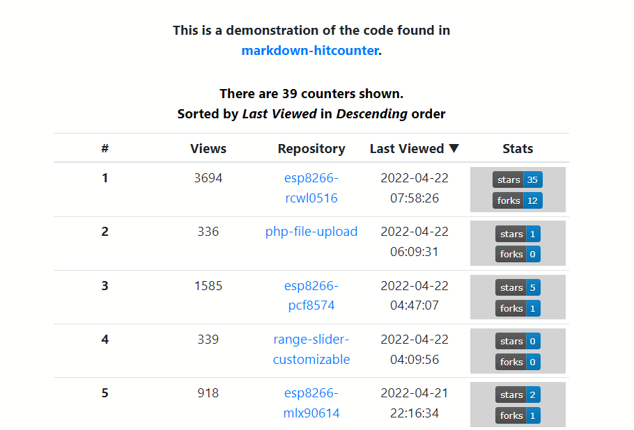

# Markdown Hit Counter

This counter is intended for use in GitHub README markdown files. It has the following features:

* It is accessed in a `` tag in the markdown file.
* It will only count for specified IDs. IDs are a means to identify which README was viewed. 
* It does **not** display the current count. This is intentional.
* It's *small*, less than **115kb** in size.
  * Code + JSON = **~4k**
  * Images = **~111k** - The only reason it's this big is because of the "error" images, they're supposed to be obvious. The actual image that used in counting is less than 1k in size.

## Run Time Requirements

You will need:

* A HTTP server, not HTTPS. It has not been tested with HTTPS. **If you get it to work with HTTPS please let me know and I will update this file.**
* The server needs PHP >5.6.
* You will need access to your server to copy files and create a folder.

## Set Up

These set up instructions will verify that it's working. However for *live use* some editing is required, this will be described later.

**1)** Copy the following files to a desired location on your server. Typically this will be in a `public_html` folder or in a sub-folder(*recommended*) of `public_html`.
* counters.json
* mdcount.php
* All PNG files, blank-10x10.png, err-10x10.png, id_err.png, id_oops.png, and test-246x246.png
* **NOTE:** It is not necessary to copy the `mdimg` folder to the server!

**2)** In the folder where you copied the files to create a *new* folder named **logs**.

### Test Run

Open `example.html` in your editor and:

**1)** Find the `` tags and edit the `src` attributes. 

* Replace all occurrences of **`[your-server]/[some-folder]`** with your server's domain and the sub-folder where you placed the files.

**2)** Then on your PC run the `example.html` file by double-clicking it or by dropping it onto an open browser window.

**Test Run Expected Results:**

**a)** At the top of the page you should see this:


**b)** A little further down the page you will see where there does not appear to be an image. It's there, it's just small (10px X 10px) and *transparent*.


**c)** The last two images demonstrate how errors are handled. The two types of errors that can occur are:

* An invalid ID
* The ID query is missing

The images are large *on purpose*. They're meant to be obvious when something is wrong.


**d)** In the folder where you placed the files you will have a *new* file named `testtest_count.log`.

**e)** In the sub-folder named `logs` you should have 2 new files, `example_1_count.log` and `example_2_count.log`.

Each of the `*.log` files should have a count of **`1`** in them.

## Counter Log Files

The counter log files will be found in the folder `./logs`. They are JSON formatted and contain the current count and the date and time of the visit. 

Here is an example:

```
{
  "count": 2,
  "time": 1616961746,
  "dtime": [
    "20210328",
    "150226"
  ]
}
```

## Markdown Usage

Use within a GitHub markdown file is easy. You cah add the counter to a `README.md` file or any other `*.md` file in any of your repositories.

The following line can go anywhere in the markdown file but at the bottom is recommended.

**``**

### Edit `counters.json`

The `counters.json` file contains *IDs* that insure that each use has its own *counter log file*. The `counters.json` file in this repository looks like this:

```
{
  "valid":[
    "TESTTEST",
    "example_1",
    "example_2"
  ]
}
```

Then:

**``**

will create this file - `logs/example_1_count.log`, and each time the containing file is opened it will increment the count in that `log` file.

Let's say you have a README in your repository named `My Repo`. First add it to the `counters.json` file like this:

```
{
  "valid":[
    "TESTTEST",
    "example_1",
    "example_2",
    "My_Repo"
  ]
}
```

And to count use this:

**``**

The resulting file will be `logs/my_repo_count.log`.

**NOTE:** Replace any spaces with an underscore or hyphen. The incoming IDs and those in the `counters.json` file can be mixed case because they are converted to lower case before they're checked.

### Edit `images.json` (*optional*)

The `images.json` file contains the file names of the PNG files and their path *relative* to the sub-folder where you placed the images and `mdcounter.php`. 

```
{
    "path": "./",
    "testimg": "test-246x246.png",
    "countimg": "blank-10x10.png",
    "errimg": "id_err.png",
    "oopsimg": "id_oops.png"
}
```

The `"path": "./"` member may also be edited if necessary. 

## Things that Trigger the Counter

Other than a "normal view" here are somethings that will trigger the counter:

* WYSIWYG markdown editors. Each time you open the markdown file it will trigger a count.
* Refreshing GitHub repository main page while viewing it.

## Count Data Retrieval

It is possible to retrieve the counter data for a single counter or for all of them. This can be accomplished with - 

**Return data for a specific counter -**

```
GET http[s]://your-server/path-to-file/mdcountdata.php?id=testtest
```


**Return data for all counters -**

```
GET http[s]://your-server/path-to-file/mdcountdata.php
```

The data is returned in JSON - 

```
[
    {
        "id": "sensornet",
        "data": {
            "count": 30,
            "time": 1616458038,
            "dtime": [
                "20210322",
                "190718"
            ]
        }
    },
    {
        "id": "test",
        "data": {
            "count": 1,
            "time": 1616458038,
            "dtime": [
                "20210322",
                "190718"
            ]
        }
    }
]

```

**Sorting Counter Data -**

The counter data can be sorted by **`count`** before returning it to the caller.

The data is returned in ascending order -

```
GET http[s]://your-server/path-to-file/mdcountdata.php?csort=a
```

The data is returned in descending order -

```
GET http[s]://your-server/path-to-file/mdcountdata.php?csort=d
```

One of the following sorts can be chosen:

* `csort` - sort by count value
* `tsort` - sort by time of last hit
* `isort` - sort by counter ID

**Limiting Number of Counters in Sort -**

It is possible to limit the quantity of counters returned for any of the sorting queries.

```
GET http[s]://your-server/path-to-file/mdcountdata.php?csort=a|[&limit=[1-n]]
```

The value of `limit` can be from 1 to **n**. If **n** exceeds the number of counters then all counters will be returned for that sorting choice.

**NOTE** : `limit` only applies to sorting queries.

**Errors -**

If an error occurs it is also returned in JSON - 

```
GET http[s]://your-server/path-to-file/mdcountdata.php?id=BLAH


[
    {
        "error": true,
        "msg": "BLAH not found in ./counters.json"
    }
]
```

## Counter Reports

The following files are used in report generation and viewing:

* `mdreport.php` - Retrieves the counter data and renders a Bootstrap 4.x table.
  * `mdreport.css` - Additional required CSS for the table
  * `mdreport-th.txt` - Column heading text
  * `stddefines.php` - A collection of `define()` that make a number of PHP `$_SERVER[]` values available to the application. It contains components used for creating URLs to resources.
* `report.html` - The minimum required HTML/CSS and JavaScript/jQuery to render and display the table.
  * **Other Dependencies** : The "tool tips" used on the column headings are created with [tippy.js](<https://atomiks.github.io/tippyjs/>).

**Retrieving the Report -**

The code that retreives the report and handles clicks on the column headings is contained in `report.html`. 

```
<body>
    <div id="repout">
    </div>
<script>
document.addEventListener("DOMContentLoaded", () => {
    /*
        Send a GET request and invoke a 
        callback function when completed.
    */
    function httpGet(url, callback, tickle = false) {
        var xmlhttp = new XMLHttpRequest();
        xmlhttp.onreadystatechange = function() {
            if(this.readyState == 4 && this.status == 200) {
                var resp = this.responseText;
                callback(resp);
            }
        };
        // bypass caching, useful when retrieving resources
        // that change frequently
        if((tickle === true) && (url.includes('?') === false)) {
            url = url + '?_=' + new Date().getTime();
        }
        xmlhttp.open('GET', url, true);
        xmlhttp.send();
    };

    //////////////////////////////////////////////////////////////////////////
    // sorting types
    var sorts = ['?csort=','?isort=','?tsort='];
    // sort directions
    var sdirs = ['a','d'];
    // URL to report generator
    var url = './mdreport.php';
    // optional limiting qty of counters returned
    var limit = '&limit=10';
    // 
    var datasrc = url+sorts[2]+sdirs[1];//+limit;

    // create a table with mdreport.php and place 
    // it within an specified element ID
    function createTable(elemid, ds) {
        httpGet(ds, (resp) => {
            $(elemid).html(resp);
            // wait for a column in this table to be clicked
            $(elemid+' .orderhover').click((col) => {
                var target = {
                    id: col.target.id,
                    ix: col.target.dataset.ix,
                    order: col.target.dataset.order
                };
                $(document).trigger('newtable', target);
            });
        },false);
    };

    // render the table of counters
    createTable('#repout', datasrc);

    // when a column heading is clicked 
    $(document).on('newtable', (e, target) => {
        $('.orderhover').off('click');
        // build the URL and query...
        var datasrc = url+sorts[target.ix - 1] + (target.order === 'a' ? 'd' : 'a');// + limit;
        // erase the previous table
        $('#repout').html('');
        // go get it!
        createTable('#repout', datasrc);
    });
});
</script>
</body>
```

**Sample Report Screen Shot -**



The "Hit Count", "Repository" and "Last Counted" headings can be clicked to select sorting criteria and direction (*ascending vs descending*). When a column heading is clicked the report caption will change to reflect the choice.

**A demonstration of the counter report can be seen [here](https://webexperiment.info/portfolio/mdhc/).**

**NOTES :**
* The links in the "Repository" column and built from the IDs found in `counters.json`. The ID text I used there is the *name of the repository* that the counter is intended for. The corresponding counter data files are named `repo-name`**`_counter.json`**.
* When the report is viewed the data shown is *current*. 
* If the "Last Counted" column date and time seem to be incorrect then the time zone may need to be changed. Edit the `timezone.json` file to match your time zone.
 
## Other Uses

You could count just about anything. All you need is to do a GET of `mdcount.php` with a proper query and you got a counter!

# Conclusion

This started out as an interesting afternoon project. I created it because I could not find *exactly* what I needed in the many hit counters out there.

And this project has evolved since then with the addition (and changes) of JSON formatted counter files, and sorted counter data retrieval.

---
